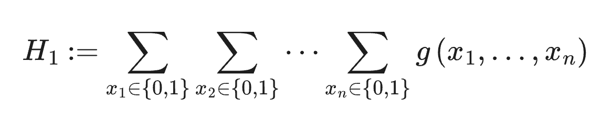
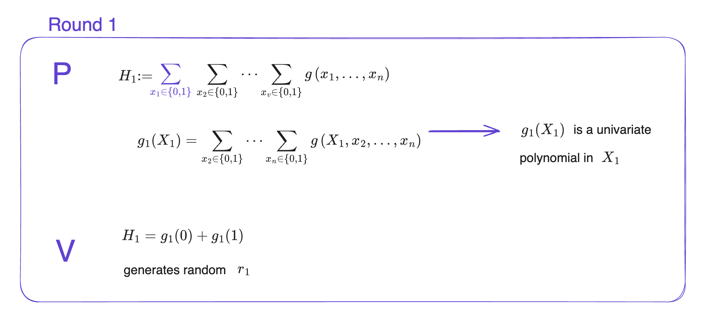
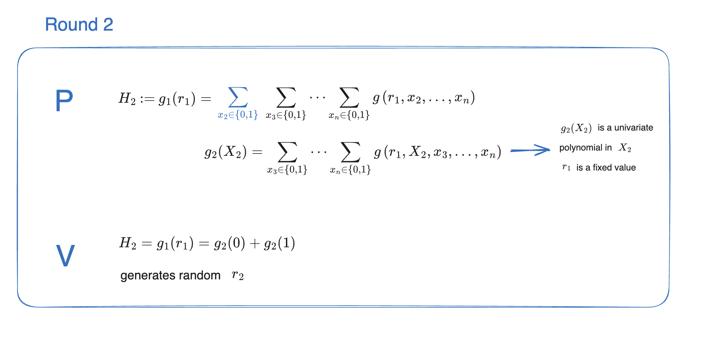

# Sumcheck

The prover \\(P\\) wants to prove to the verifier \\(V\\) the summation of a \\(n\\)-variate polynomial \\(g(x_1,\ldots, x_n)\to \mathbb{F}\\) on all possible binary input  \\(x_i \in \\{0,1\\}^n\\).

The sum results to a one dimentional constant \\(H_1 \in \mathbb{F}\\) and is defined by :

    

To solve this the verifier could compute the sum itself but it would consume \\( 2^n \\) evaluation of \\(g(x_1, \ldots, x_n)\\) and \\( 2^n \\) additions. To optimize the verifier performance, sumcheck
protocol allows  \\(V\\) to delegate most of the computation to \\(P\\), and \\(P\\) will do a series of computations and
communications to convince  \\(V\\) the correctness of the summation.

## Sumcheck iterative protocol 

In summary, at each round \\(i\\)  the prover will compute the sum over \\(n - i\\) variable send it to the verifier, the verifier will challenge the answer of the prover and the prover will prove it with round  \\(i + 1\\) over  \\(n - i - 1\\) variables, the round  \\(n\\) will be the last one and will consist of a trivial sum.

To start the prover sends the initial sum \\(H_1\\). Then in the round 1, the prover computes a univariate polynomial \\(g_1(X_1)\\), the polynomial equals to the sum on all variables except the first one that remains unbounded.

Now the verifier receives the \\(H_1\\) value and the univariate polynomial \\(g_1(X_1)\\). The verifier will check that \\(H_1 = g_1(0) + g_1(1)\\) holds and will send a random point \\(r_1\\) and challenge the prover.

    

Now the prover has to send  \\(H_2 = g_1(r_1)\\) and prove its computation, to do that it will re-execute the sumcheck protocol on \\(g_1(r_1)\\) that has now \\(n - 1\\) variables. In round 2 the prover computes the univariate polynomial \\(g_2(X_2)\\), the sum of \\(g\\) on all variables except the first variable set to \\(r_1\\) and the second that remains unbounded. Note that at each round the amount of computation for the prover decreases as the number of variable decreases.

The verifier checks that \\(H_2 = g_2(0) + g_2(1)\\) holds and will send a random point \\(r_2\\) and challenge the prover.

    

The prover and verifier recursively apply the sumcheck protocol round by round, each round another variable of \\(g\\) gets bounded to a value randomly chosen by the verifier.

Until the last round, where the last variable of \\(g\\) gets bound to a variable :

    

With all the values bounded to the randomly chosen value, the verifier can now check \\(H_n = g_n(0) + g_n(1)\\) trivially.

