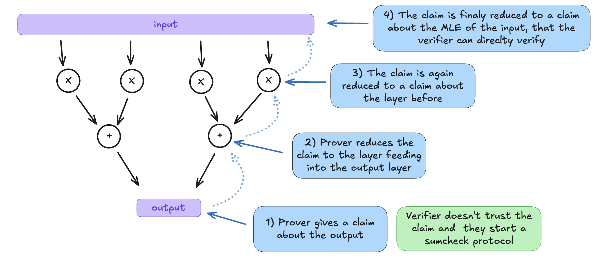
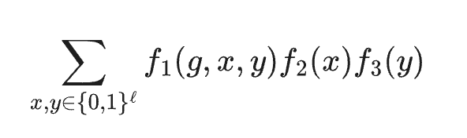
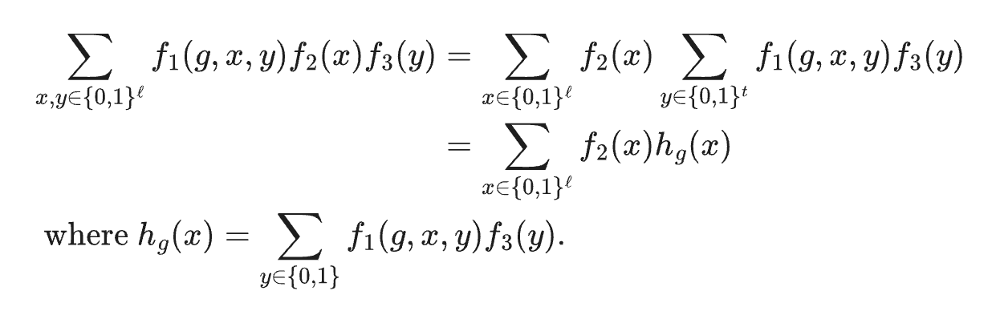

# GKR Protocol

Protocol named ather its creators Goldwasser, Kalai, and Rothblum. GKP is an  interactive proof protocol for circuit evaluation. At its core, the main primitive used in the GKR protocol is the sum-check protocol.

The gates add or mul two fields elements. The prover doesn't commit to anything and the verifier need to evalutate the MLE of the input at a random point.

On the image below we have a small circuit with a layer of multiplication and a layer of addition. The GKR protocol first start with a claim of the output and then iteratively reduces into a claim about the layer before, until a last claim about he MLE of the input that the verifier can verify.

All claims are challenged randomly by the verifier, the last claim is also randomly challenged and can be verified by the verifier.

    

We can define the following class of functions from the GKR protocol description :

    

Where :
* \\(f_1(g, x, y)\\) : Is the representation of the gates in the circuit. It is a sparse array and can be stored as a bookkeeping table (that only stores non-zero values).
* \\(f_2(x)\\) and \\(f_3(y)\\) : Represent the inputs of the gates of the previous layers feeding into the current layer. They are multi-linear extention of arrays, 

Now to be able to apply the Sumcheck protocol, the equation is rewritten as : 

    

Which can be solved using two successive product Sumcheck.

