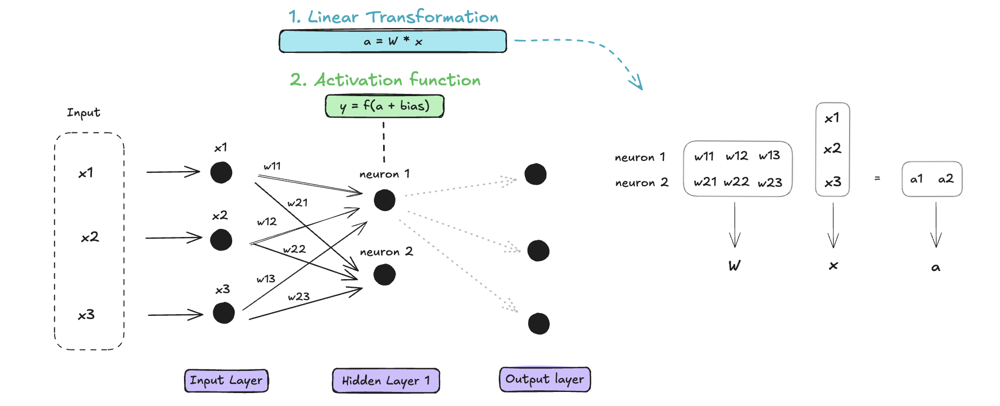

# Normalization in Neural Networks

Training Deep Neural Networks can suffer from the variation of the distribution of each layer’s inputs. This happens during the training as the parameters of the previous layers change and slows down the training by requiring lower learning rates and careful parameter initialization. This phenomenon is called **Internal Covariate Shift (ICS)**. Addressing this problem has been the initial motivation for normalizing layer inputs.

On the Diagram, we represented a Neural Network, more specifically a Feed Forward Neural Network with one hidden layer, and the computation it performs on an input. For training this computation is done on a batch of training data with a feedback system to calibrate the weights.

## Layer Normalization (LayerNorm)

A solution was to standardize each summed input across the training data using normalization. One way to do it was in this [paper](https://arxiv.org/pdf/1607.06450) : *LayerNorm*. Layer normalization normalizes the activations across the hidden units within a single layer for each data point independently. 

Therefore the normalization is done at the same place in the network but is done independently for each input items.

Because it normalizes the pre-activation values, LayerNorm introduces a **re-centering and re-scaling invariance property**. The former enables the model to be insensitive to shift noises on both inputs and weights, and the latter keeps the output representations intact when both inputs and weights are randomly scaled. 

\\[
ā_i = \frac{a_i - \mu}{\sqrt{\frac{1}{n} \sum_{i=1}^n (a_i - \mu)^2}} g_i, \quad \text{where} \quad \mu = \frac{1}{n} \sum_{i=1}^n a_i
\\]

Where:
- \\(\mu\\) and \\(\sigma\\) are the mean and standard deviation of \\(a_i\\), computed across the neurons in a layer.
- \\(g_i\\) is a learnable scaling parameter.

## Root Mean Square Layer Normalization (RMSNorm)

*RMSNorm* was introduced as another solution to ICS, in this [paper](https://arxiv.org/pdf/1910.07467), and is used in LLaMa2. It shows similar performance that *LayerNorm* with less computation overhead. *RMSNorm* was created from the hypothesis that the **re-scaling invariance** is the reason for the success of *LayerNorm*, rather than re-centering invariance. RMSNorm only focuses on re-scaling invariance and regularizes the summed inputs simply according to the root mean square (RMS). Which makes RMSNorm computationally cheaper than LayerNorm.

*RMSNorm* works in the same fashion as *LayerNorm*, the normalization happens for each item of the batch with the norm over all the neurons of the layer. The only difference is the computation of the norm; only the RMS is computed.

The formula for *RMSNorm* is:

\\[
ā_i = \frac{a_i}{\sqrt{\frac{1}{n} \sum_{i=1}^n a_i^2}} g_i
\\]

