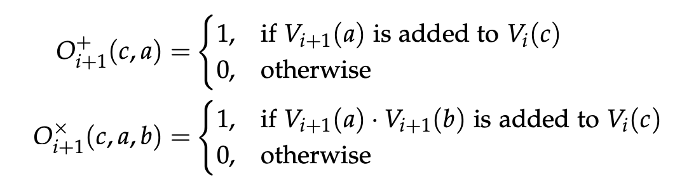
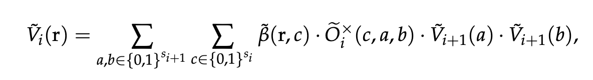
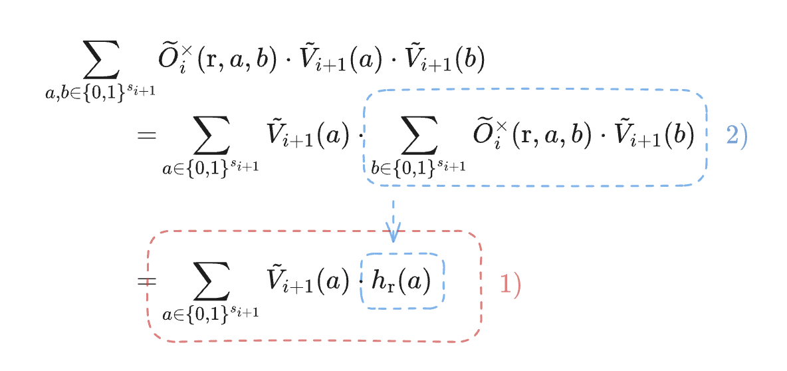

# SpaZK

In machine learning (ML), techniques like pruning and quantization often lead to sparsity in large models, a property extensively utilized to enhance the efficiency of model inference. 

However, this concept of sparsity has yet to be fully explored in the domain of ZKML.

[*SpaZK*](https://eprint.iacr.org/2024/1018.pdf) was the first ZKML protocol introduced to address this gap. A ZKML framework based on the GKR protocol exploiting sparsity to improve proof generation efficiency.

## GKR Protocol 

At its core, SpaZK employs the GKR protocol, an interactive proof system designed for circuit evaluation.

In this context, the GKR protocol is applied to a circuit that represents the computation of a neural network using add and mul gates.

### Circuit representation 

To leverage the GKR protocol, we formalize the neural network model as a circuit. The circuit can be represented as follow : 

* The output layer of the neural network is labeled as layer 0, while the input layer is labeled as layer d.

* For each \\(\ i \in \{0, d\} \\), the outputs of layer i + 1 serve as inputs to layer i. This reverse ordering arises because the Sumcheck protocol in the GKR framework begins with a claim about the output layer (layer 0) and iteratively reduces the claim to preceding layers, ultimately arriving at a final, easily verifiable claim about the input layer (layer d).

    
     
    <i>This image represents the circuit where each layer feeds into the next, along with an overview of the GKR protocol, which begins with a claim about the output layer and, after *d* iterations, reduces to a claim about the input layer.</i>

### Mathematical represenation
The gates of the circuit, represented by the nodes in the diagram, are sparsity-aware gates and are defined by :

    

From this we have that each layer \\(i\\), with \\(S_i\\) gates and \\(s_i = log\(S_i\)\\), can be represented as a function \\(V_i : \{0, 1\}^{s_i} → F\\) which evaluates the output of the layer from a binary input that corresponds to the index of the gate of the previous layer feeding into the current layer in its binary representation. This function is represented by :

    

# In practice : example with Linear Layers

In a Linear Layer, the only computation involved is the sum of products between weights
and data. Therefor the GKR protocol will be applied on circuit, representing the linear layer with *mul* gates. The equation of  \\(V_i\\) becomes :

    

To be able to execute the Sumcheck protocol necessary for GKR protocol on this equation, it's factorized as a product of two factors on which two successive product Sumcheck protocols can be applied.

    

The protocol will consists of two parts, the first will perform a sumcheck protocol on Eq 1) to fix the variable a, with variable b summed on the boolean hypercude. And then once the variable a is fiexed, a Sumcheck on Eq 2) on the variable b.

