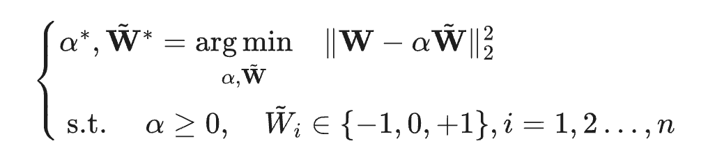
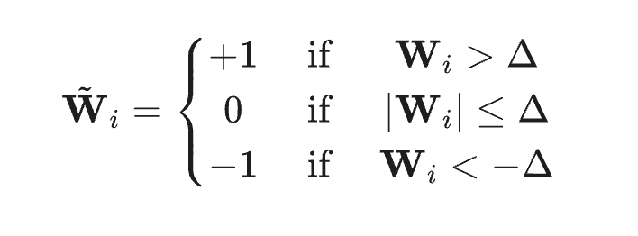
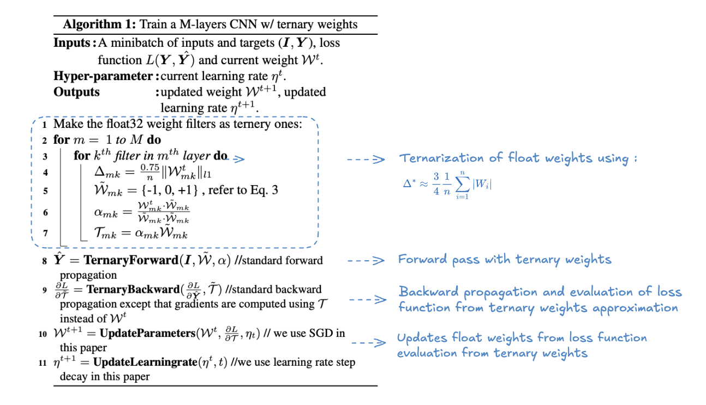
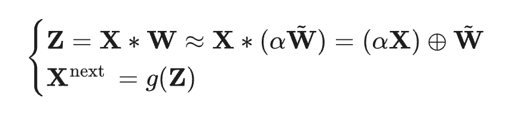

# Ternary Weight Networks

Ternary Weight Networks (TWNs) were introduced in this [paper](https://arxiv.org/pdf/1605.04711) as a memory and computation efficient
networks representation.

The goal of TWNs is to find the ternary weight, weight in {-1, 0, 1}, that minimizes the difference with the initial float weight, the distance is chosen to be defines as the eucleadian distance with a nonnegative scaling factor. For Ternary weights \\( W \\) and ternarized weight \\( W̃ \\) the function is :

    

The problem of solving this equation is simplified into the problem of findind the delta that will map float weight to the values -1, 0 and 1 as :

    

Finally the problem of finding such delta is simplified, depending on the assumption whether \\( W \\) follows a Uniform or a Normal distribution :

* Uniform distribution : \\(\Delta^* \approx \frac{2}{3} \frac{1}{n} \sum_{i=1}^{n} |W_i|\\)

* Normal distribution : \\(\Delta^* \approx \frac{3}{4} \frac{1}{n} \sum_{i=1}^{n} |W_i|\\)

## Training 

The training is done as follow :

* In the forward pass, the ternarization operation is applied on the weight, the float32 weight are cached for future
parameter update. 
* In the backward pass, ternary weight gradient is calculated to update the float32 weight.

Here is the complete algorithm of the training process :

    

## Inference

Once the training is performed, the inference is straightforward. The forward pass with ternary weight becomes : 

    

